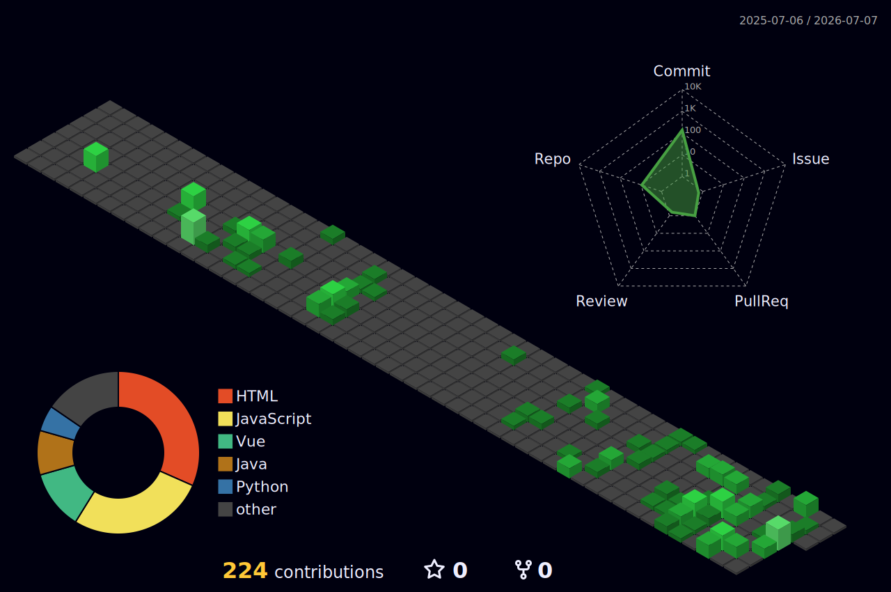

## Olá, sou Matheus Oliveira Costa 👋

🎓 Estudante do 5º período de Engenharia de Software na UTFPR (Campus Cornélio Procópio).
🚀 Desenvolvendo projetos back-end e explorando a integração de sistemas.
🌱 Aprofundando conhecimentos em Java (Spring Boot) para back-end e Python para Data Science/Machine Learning.
👯 Buscando minha primeira oportunidade de estágio para gerar valor e crescer na área de TI.

---

## 🛠️ Ferramentas e Tecnologias

---

## 💻 Projetos em Destaque

* **[Organizer-Java-Backend](#)**: Um sistema robusto de gerenciamento de tarefas. O projeto integra um back-end estruturado em Java e Spring Boot com uma interface front-end construída com React.js, utilizando MySQL para persistência de dados.
* **[E-Logic Car](#)**: Uma interface web conceitual para uma concessionária de carros elétricos, desenvolvida para aprimorar habilidades práticas de front-end utilizando HTML, CSS e JavaScript.

---

## 📊 Estatísticas & Linguagens

---

## 🔗 Conecte-se Comigo

  

